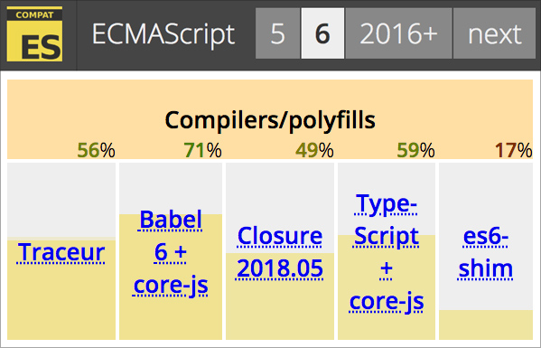

## TypeScript & ECMAScript 2015

[ECMAScript 호환성 표][1]를 살펴보면 TypeScript는 ES6[^1]의 상당 기능을 지원(약 59%)합니다.
[Babel][2] 컴파일러 지원율(약 71%)에 비해 다소 떨어지지만, ES6에서 지원하지 않는 강력한 기능을 TypeScript에서 활용할 수 있다는 점이 강점입니다.
ES6의 문법과 관련하여 TypeScript 코드를 비교해보는 시간을 가져보겠습니다.

<!-- 링크 -->

[1]: http://kangax.github.io/compat-table/es6/
[2]: https://babeljs.io

 

---

##### 각주

[^1]: ECMAScript 2015는 6번째 에디션입니다. 2015년 이후부터는 버전 넘버 대신 발표(release) 년도를 사용하고 있습니다. 이와 같이 변경됨에도 불구하고 간단한 버전 이름으로 부르는 경우가 많습니다.